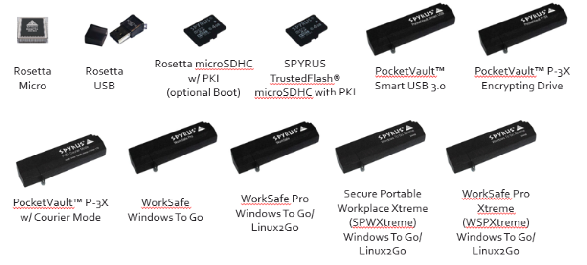
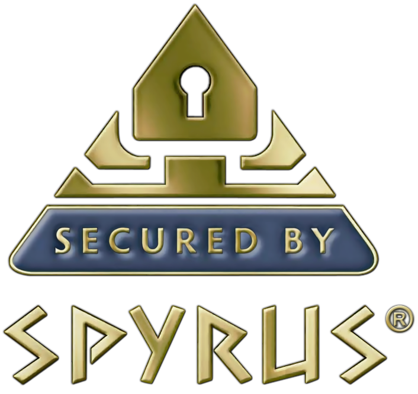

SPYRUS Product Design Information License Agreement
===================================================

PLEASE READ THIS! This is a legal agreement between SPYRUS, Inc.
("SPYRUS") and the recipient of this document, whether an individual or
an entity ("You"). BY ACCESSING, USING, REVIEWING OR READING THIS
DOCUMENT OR PROVIDING FEEDBACK ("this document"), YOU AGREE TO BE BOUND
BY THESE TERMS. IF YOU DO NOT AGREE TO THESE TERMS STOP READING AND
DESTROY THIS DOCUMENT, AND DO NOT PROVIDE ANY FEEDBACK.

1.  **This document is SPYRUS confidential information under Your most
    recent Non-Disclosure Agreement with SPYRUS.** However, Your only
    rights to use this document are as described in Paragraph 2 below.
    You are being granted a non-transferrable, defeasible license to
    review the material in this document only if you comply with the
    terms herein.

2.  You may review the material in this document only (a) to provide
    feedback to SPYRUS; or (b) as a reference to assist You in planning
    and designing your product, service or technology ("Your Product")
    to interface with a SPYRUS product, technology or service ("SPYRUS
    Product") as described in this document. All other rights are
    retained by SPYRUS; You have no other rights to use the intellectual
    property in this document. You may not (i) duplicate any part of
    this document, (ii) remove this Agreement or any notices from this
    document, or (iii) give any part of this document, or assign or
    otherwise provide Your rights under this Agreement, to anyone else.

-   **You have no obligation to give SPYRUS any suggestions, comments,
    or other feedback.** If You do give SPYRUS feedback on any version
    of this specification, You agree that SPYRUS may freely use,
    disclose, reproduce, license or otherwise distribute, and exploit
    Your feedback in its products, services, technologies,
    specifications and other documentation ("SPYRUS Offerings"), without
    any intellectual property restrictions, payments or other
    obligations.

3.  This document contains preliminary information that may change prior
    to release of any associated SPYRUS Product, and is provided
    entirely "AS IS." To the extent permitted by law, SPYRUS MAKES NO
    WARRANTY OF ANY KIND EXPRESS OR IMPLIED, DISCLAIMS ALL EXPRESS,
    IMPLIED AND STATUTORY WARRANTIES, AND SHALL HAVE NO LIABILITY TO YOU
    FOR ANY DAMAGES, IN CONNECTION WITH THIS DOCUMENT OR ANY
    INTELLECTUAL PROPERTY IN IT.

4.  If You are an entity and are acquired, or if more than a 20% of your
    ownership changes, or if You are an individual and change
    employment, this Agreement terminates with no further notice and You
    must destroy this document.

5.  This Agreement is governed by the laws of the State of California.
    Any dispute involving it must be brought in the federal or state
    courts located in Santa Clara County, California, and you waive any
    defenses allowing the dispute to be litigated elsewhere. If there is
    litigation, the loser must pay the other party's reasonable
    attorneys' fees, costs, and other expenses. If any part of this
    Agreement is unenforceable, it will be considered modified to the
    extent necessary to make it enforceable, and the remainder shall
    remain in effect. This Agreement is the entire agreement between You
    and SPYRUS concerning this document; it may be changed only by a
    written document signed by both You and SPYRUS.

**\
**

Table of Contents
=================

[SPYRUS Product Design Information License Agreement
ii](#spyrus-product-design-information-license-agreement)

[Table of Contents iii](#_Toc519176214)

[Introduction 1](#introduction)

[Shared Access Signature (SAS) Token with SPYRUS HSM HMAC Key
2](#shared-access-signature-sas-token-with-spyrus-hsm-hmac-key)

[X.509 Authentication Over TLS/SSL Using SPYRUS HSM Private Key &
Certificate
2](#x.509-authentication-over-tlsssl-using-spyrus-hsm-private-key-certificate)

[IoT Device Provisioning Using Device Private Key Stored in the SPYRUS
HSM
3](#iot-device-provisioning-using-device-private-key-stored-in-the-spyrus-hsm)

[More Information 4](#more-information)

Introduction
============

This document provides a very brief overview of how SPYRUS family of
Hardware Security Modules (HSMs) powered by Rosetta® can be integrated
into the Azure IOT SDK.

The Azure IOT SDK provides 3 main mechanisms for device
authentication/registration: -

1)  Shared Access Signatures (SAS)

2)  X.509 Certificate based Authentication

3)  Azure IoT Device Provisioning Service

The SPYRUS IOT SDK improves the security of all 3 of these mechanism by:

1.  Replacing the current software HMAC used in Shared Access Signature
    (SAS) Token generation with a hardware based HMAC using a key stored
    in a SPYRUS HSM.

2.  Replacing the PEM encoded certificate and private key used in X.509
    Authentication over SSL/TLS with hardware based private key and
    certificate stored in a SPYRUS HSM.

3.  Replacing the PEM encoded certificate and private key used in Device
    Provisioning with hardware based private key and certificate stored
    in a SPYRUS HSM.

These integrations are implemented using PKCS \#11 so that the whole
family of FIPS 140-2 validated SPYRUS HSMs Rosetta devices are available
as options for integration with the Azure IOT SDK.

Shared Access Signature (SAS) Token with SPYRUS HSM HMAC Key
============================================================

The Azure IoT SDK uses a software based Base 64 encoded HMAC key to
generate a SAS token. The SPYRUS IoT SDK enhancements accomplish this
using hardware backed keys and cryptography. SPYRUS replaces the
software based HMAC with a hardware HMAC using a HMAC key stored in the
SPYRUS HSM.

The SPYRUS IoT SDK contains the required changes to replace the software
HMAC with a hardware HMAC. It also contains code for you to load your
device primary key into your SPYRUS HSM device as a PKCS \#11 secret
key. Using a hardware based key for the HMAC improves security without
changing anything in the application code. No code changes are required
to your SAS token based applications to use hardware keys stored in the
SPYRUS HSM.

The SPYRUS IoT SDK makes it a simple 5 step process to get your device
authenticating with the Azure IoT Hub using hardware based SAS Token
Generation: -

1)  Replace the software HMAC with an API call into the SPYRUS IoT SDK
    to do a PKCS \#11 HMAC using the Secret Key\
    A modified source file is provided so that you can drop in this
    change into your copy of the Azure IoT SDK. This change is made once
    per SDK installation.

2)  Configure your SPYRUS HSM device in your IoT Hub

3)  Initialize the SPYRUS HSM Device\
    This sets up PKCS \#11 on the SPYRUS HSM Device

4)  Import the Device Primary Key onto the SPYRUS HSM device as a PKCS
    \#11 Secret Key

5)  Device authenticates with Azure IoT using SAS Token

This makes authentication of your devices with Azure IoT using SAS
Tokens a simple process while vastly improving security.

X.509 Authentication Over TLS/SSL Using SPYRUS HSM Private Key & Certificate
============================================================================

The Azure IoT SDK when doing X.509 Authentication is using PEM encoded
strings for the private key and certificate which are stored directly in
the application code. The SPYRUS IoT SDK enhancements allow for X.509
Authentication using hardware backed keys and cryptography. SPYRUS
replaces the PEM encoded strings with object references to the private
key and certificate stored in PKCS \#11 on the SPYRUS HSM.

The SPYRUS IoT SDK contains the changes required to Azure IoT SDK to
enable these object references to be passed through to the OpenSC libP11
library which forwards the requests to the SPYRUS PKCS \#11 Library thus
allowing for the SPYRUS hardware based private key and certificate to be
used for X.509 Authentication.

The SPYRUS IoT SDK makes it a simple 5 step process to quickly get your
device authenticated using X.509 Authentication using hardware based
credentials:

1.  Issue your Device Credentials (Private Key + Certificate) using your
    Verified Certificate Authority (CA)\
    The credentials should be issued as a PKCS \#12 file.

2.  Initialize the SPYRUS HSM Device\
    This sets up PKCS \#11 on the Rosetta Device

3.  Import your Device Credentials (PKCS \#12 file) onto the SPYRUS HSM
    device

4.  Replace the two PEM strings (private key and certificate) in your
    application code with object references.

5.  Your device now authenticates with Azure IoT using your hardware
    credentials stored in the Rosetta security controller embedded in
    the SPYRUS HSMs.

This makes authentication of your devices with Azure IoT using X.509
Authentication a simple process while vastly improving security.

IoT Device Provisioning Using Device Private Key Stored in the SPYRUS HSM
=========================================================================

The Azure IoT SDK when doing Device Provisioning using X.509
Certificates is using PEM encoded strings for the private key and
certificate which are stored directly in the application code. The
SPYRUS IoT SDK enhancements enable X.509 device attestation using
hardware backed keys and cryptography. SPYRUS replaces the PEM encoded
strings with Object References back to keys and certificates stored in
PKCS \#11 on the SPYRUS HSM device. For this to work, the SPYRUS Custom
HSM is linked with the Azure IoT SDK. This provides the object
references when asked for the private key and certificate. The SPYRUS
IoT SDK also contains the changes required to the Azure IoT SDK to
enable these references to be passed through to the OpenSC libP11 Engine
which forwards the requests to the SPYRUS PKCS \#11 Library.

The SPYRUS IoT SDK changes allow for a device to be provisioning
successfully with the Azure IoT Device Provisioning Service using a
simple 5 step process:

1.  Issue Credentials for Device (Private Key and Certificate) using
    your verified Certificate Authority\
    This credential should be issued as a PKCS \#12 file.

2.  Import the device credentials to your SPYRUS HSM Device.

3.  Configure the SPYRUS Custom HSM\
    Set in the configuration file the certificate common name, and the
    object references for the private key and certificate. This step is
    only required if more than one credential is issued to the device.
    If only a single credential is present the SPYRUS Custom HSM will
    automatically identify and use this credential. This enables a
    device to be deployed with zero post-production configuration.

4.  Set ID Scope in Provisioning Code\
    This provides the linkage to your Device Provisioning Service.

5.  Device Registers with the Device Provisioning Service using Hardware
    Credentials.

This makes provisioning of your SPYRUS HSM devices with the Device
Provisioning Service easy, while also vastly improving security.

More Information
================

For a more detailed explanation of any of these improvements to the
Azure IoT SDK please consult the document "Integration of Rosetta into
Azure IoT SDK".
